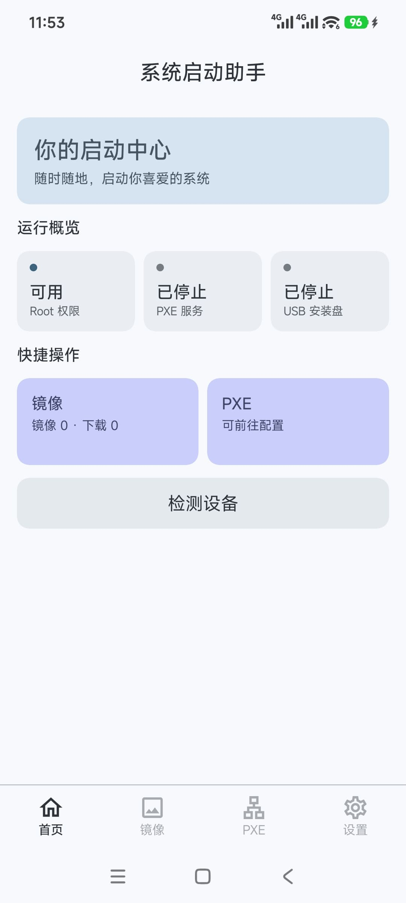
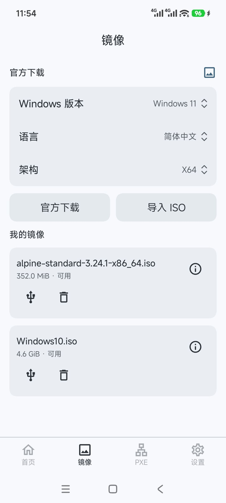
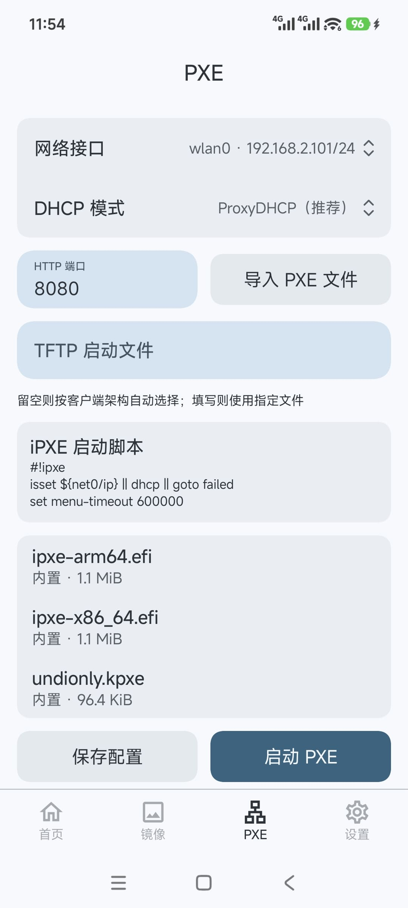

# 系统启动助手（NetBoot）

让已获 KernelSU 授权的 Android 手机提供 **PXE 网络启动**或**只读 USB 启动盘**，
并支持微软官方 Windows ISO 下载、本地镜像导入和断点续传。

## 使用前提

- Android 8.0 及以上，KernelSU 已授权本应用使用 `su`。应用启动时自动检测现有权限，不安装或修补 Root。
- PXE：手机和电脑接入同一局域网，网络允许设备互访；电脑支持网络启动。
- USB：使用数据线连接电脑；手机内核和 USB 配置需支持添加存储功能。

## PXE 网络启动

1. 打开「PXE」，选择网络接口。家庭网络使用 **ProxyDHCP**；完整 DHCP 仅用于隔离网络。
2. 启动文件留空即可按电脑架构自动选择，也可导入文件并配置 iPXE 脚本。
3. 点击「启动 PXE」，在电脑启动菜单中选择网络启动；用完在应用中停止服务。

默认菜单需要联网获取安装资源。「镜像」页的 ISO 不会自动作为 PXE 安装源；修改运行配置后需重启服务。

## 镜像与 USB 启动盘

1. 在「镜像」页下载或导入 ISO，等待状态变为「可用」。
2. 用数据线连接电脑，点击镜像的 USB 图标并选择「启用」。需要制作时会显示进度，可取消，原始镜像不变。
3. 在电脑启动菜单中选择手机提供的只读磁盘或光驱。
4. 用完先在应用中「停止 USB 启动」，待恢复后再拔线；恢复失败时先重试，仍失败则重启手机。

使用期间请勿切换 USB 模式，文件传输和 USB 调试可能暂时断开。实际兼容性取决于镜像、电脑固件和手机驱动。

## 预览

<div style="display:inline-block">



</div>

## 构建与发布

使用与 CI 一致的 JDK 25、Android SDK 37、NDK 28.2.13676358 和 Go 1.27.1；
JVM 编译目标为 17，Gradle 由项目 Wrapper 固定。

```bash
./gradlew testDebugUnitTest lintRelease
./gradlew assembleRelease -PnetbootVersionName=1.0.0
# 仅在需要模拟器 ABI 时
./gradlew assembleDebug -PnetbootAbis=arm64-v8a,armeabi-v7a,x86_64
# 需要已连接的专用测试设备
./gradlew connectedDebugAndroidTest
```


开发规范与测试要求见 [AGENTS.md](AGENTS.md)，第三方来源和许可见 [NOTICES.md](NOTICES.md)。
